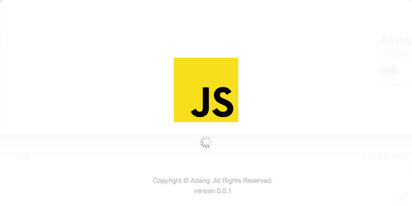
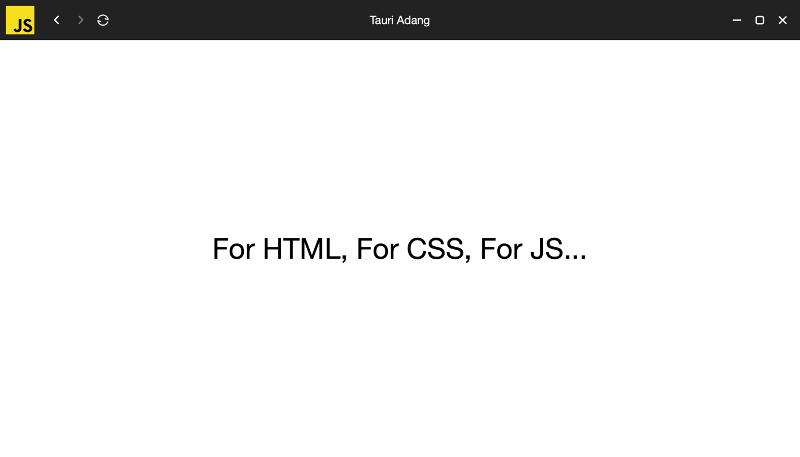

# Tauri + Vanilla

初始化一个使用`Tauri`打包的桌面端应用，也可以配合`Vue`等一起使用.

## 官方文档
[Tauri](https://tauri.app/zh-cn/)

[开发环境安装](https://tauri.app/zh-cn/v1/guides/getting-started/prerequisites)

## 开发
```shell
yarn
yarn run tauri dev
```

## 发布
```shell
yarn
yarn run tauri build
```

### window 下的坑
1、部分依赖文件很难下载成功，可以手动将文件放到`C:\Users\Administrator\AppData\Local`目录中. [Local File](./zip/tauri.zip)，将此压缩外解决到`Local\tauri`目录中；可以参考官方[issues](https://github.com/tauri-apps/tauri/issues/7338).

2、`yarn run tauri dev` 或者 `yarn run tauri build` 的时候可能有很多包下载不成功，多执行几次就好了.

3、`NsisConfig`中的`headerImage`、`sidebarImage`必须使用在`window`系统下生成的`.bmp`图片文件.


### 下载
> [Window x64 msi](./zip/)
> 
> [Window x64 nsis](./zip/)

> [MAC dmg](./zip/Adang_0.0.1_x64.dmg)

### 界面

loading:



main:




## Recommended IDE Setup

- [VS Code](https://code.visualstudio.com/) + [Tauri](https://marketplace.visualstudio.com/items?itemName=tauri-apps.tauri-vscode) + [rust-analyzer](https://marketplace.visualstudio.com/items?itemName=rust-lang.rust-analyzer)
